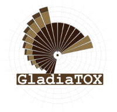

# GladiaTOX

**Table of Contents**
* [Introduction](#introduction)
* [License](#license)

## Introduction

**GladiaTOX** is an open-source solution for HCS data processing and reporting that expands the tcpl package
(toxcast pipeline, *Filer et al., 2016*). In addition to tcpl's functionalities (multiple dose-response fitting and 
best fit selection), **GladiaTOX**

- Fetches raw image quantifications via a webservice layer, also allowing multiple (proprietary) systems to be 
integrated easily
- Computes minimal effective concentrations based also on historical data
- Exports results formatted for ToxPI GUI
- Compute exposure severity scores
- Implements a suite of functionalities for quality control and processing reporting

## License

**GladiaTOX** is distributed under the [GPL v2](https://www.gnu.org/licenses/old-licenses/gpl-2.0.txt) license.
Copyright (c) 2018 Vincenzo Belcastro, Stephane Cano, Florian Martin, PMPSA

Please read the COPYING file.
