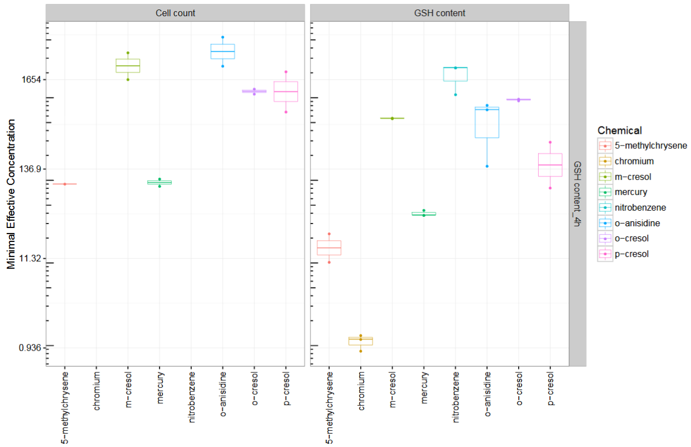

```{r setup, include = FALSE}
knitr::opts_chunk$set(
  collapse = TRUE,
  comment = "#>"
)
```

# Introduction

`GladiaTOX` is an open-source solution for HCS data processing and reporting that 
expands the `tcpl` package (toxcast pipeline, *Filer et al., 2016*). In addition 
to `tcpl`'s functionalities (multiple dose-response fitting and best fit 
selection), `GladiaTOX`

- Fetches raw image quantifications via a webservice layer, also allowing 
multiple (proprietary) systems to be integrated easily
- Computes minimal effective concentrations based also on historical data
- Exports results formatted for ToxPI GUI
- Compute exposure severity scores
- Implements a suite of functionalities for quality control and processing 
reporting

## Installation and package load
```{r, eval=FALSE, echo=TRUE, include=FALSE}
install.packages("GladiaTOX")
```

```{r, eval=TRUE, echo=TRUE, include=FALSE}
# Load GladiaTOX package and setup an output directory
# Change outdir accordingly to the folder path you want the reports to be saved
library(GladiaTOX)
outdir <- getwd()
```

<div style="position:relative; top:0px; right:0px">
```{r logo, echo=FALSE, out.width='60%'}
glPlotPieLogo()
```
</div>

## Database configuration
The `GladiaTOX` installation includes the deployment of a sqlite database 
(`sql/gladiatoxdb.sqlite` folder).

The first step after database deployment is to configure access parameters. 
The default configuration already points to the sqlite database at so no 
additional configurations are needed to complete the example below. 
Below the default database URL is assigned to the variable `sqlite_src`:
```{r, eval=TRUE, echo=TRUE, include=TRUE}
sqlite_src <- file.path(system.file(package="GladiaTOX"), "sql",
                        "gladiatoxdb.sqlite")
```

The `gtoxConf` configuration command below initializes all necessary variables.
```{r, eval=TRUE, echo=TRUE, include=TRUE}
# sqlite database location
gtoxConf(drvr = "SQLite",
         host = NA,
         user = NA,
         pass = NULL,
         db = sqlite_src)
```
This database will be used in next sections to load and process a second study 
phase. The sqlite database can be seen as a sample database used for the 
following example. 

In case users plan to use the package in production and for multiple studies, 
it is recommended to install the MySQL database
(`sql/gladiatoxdb_structure.mysql`).

In case you install the database schema or change location of the sqlite 
database, then you must run the configuration command below and point to the
new database location. For example, in case you deploy the database schema 
provided in the sql folder, then change the driver (`drvr`) to `MySQL`. 
Eventually you may need to configure your user name and password.

Below is an example of configuration call pointing to an MySQL database called 
`my_gl_database` at `local.host`:
```{r, eval=FALSE, echo=TRUE, include=TRUE}
gtoxConf(drvr = "MySQL",
         host = "local.host",
         user = "username",
         pass = "********",
         db = "my_gl_database")
```

## Deployed database
The deployed database already contains fully processed study, with

- `asid`: 1 (assay source id), the unique study identifier
- `asnm`: SampleStudy (assay source name), the names of the study
- `asph`: PhaseI (assay source phase), the study phase

The purpose of the call `gtoxLoadAsid()` is to list all studies available in the
database.
```{r, eval=TRUE, echo=TRUE, include=TRUE}
# List available studies
gtoxLoadAsid()
```

# Data and metadata for vignette
In this section we will explore one simple way for loading data in the
database. The following chunks prepare the metadata and data in R objects
(data.frame) prior database loading.

The following commands loads the data for vignette.
```{r, eval=TRUE, include=TRUE, echo=TRUE}
load(system.file("extdata", "data_for_vignette.rda", package="GladiaTOX"))
```
The command loads three objects in the environment. These objects are what
users need to prepare before study data can be loaded.

## `plate`: plate metadata
The `plate` object stores metadata with plate information. 

Most of the columns have self-contained names and content; `plate` is the plate 
number (usually an integer); `tube` is the well location (H1 is row 8 column 1);
`well_type` is the content type of the well (`c` positive control, `t` 
treatment, `n` is the negative control); `endpoint` contains assay names with no 
exposure duration info appended; `u_boxtrack` is a plate identifier used to join
the `plate` metadata table with the raw data table prior data is loaded in the 
GladiaTOX database.

```{r, eval=TRUE, echo=TRUE, include=TRUE}
print(head(plate), row.names = FALSE)
```

## `chnmap`: assay metadata and channel mapping
The second metadata table contains assay mapping information. In the example 
below two assays are shown: *Cytotoxicity (TIER1)* and *DNA damage (pH2AX)*.

Five endpoints are part of the cytotoxicity assay (e.g., *Cell count*, 
*membranepermeability*). Two endpoints are shown to be part of the DNA damage 
assay. Since multiple endpoints can be read from the same plate, each of them is
read on a separate channel. This column will also be used later on to join 
meatadata and data tables.
```{r, eval=TRUE, echo=TRUE, include=TRUE}
print(head(chnmap, 7), row.names = FALSE)
```

The content of `plate` and `chnmap` are then combined to generate the assay 
table. In the assay table, assay and endpoint are concatenated to timepoints 
to generate assays entries for the database.
```{r, echo=TRUE, eval=TRUE}
assay <- buildAssayTab(plate, chnmap)
print(head(assay, 4), row.names = FALSE)
```
## `dat`: image quantification raw data
The data table is an export from the image quantification instrument.

This table contains the raw fluorescence quantification values: `measure_val`; 
`rowi` and `coli` are the row and column indexes; `machine_name` is the channel 
name and is used to join this table with the assay table above; `u_boxtrack` 
is the plate identified and is used to join the table with the plate table.
```{r, eval=TRUE, echo=TRUE, include=TRUE}
print(head(dat), row.names = FALSE)
```

# Database loading
In this sections data and metadata will be loaded in the GladiaTOX database. 
Let's set the study parameters, study name and phase of the new study phase to 
be loaded in the database and processed.
```{r, eval=TRUE}
## Set study parameters
std.nm <- "SampleStudy" # study name
phs.nm <- "PhaseII" # study phase
```

## Register study info in database
The following code will register metadata file content in the database, 
including: assays, endpoints, treatments and controls. The status of the assay 
source table (study table) before and after new study creation is displayed 
below calling `gtoxLoadAsid()`. The purpose of the call is to list all studies 
available in the database before and after the new study is added with the 
function `loadAnnot()`.
```{r, echo=TRUE, eval=TRUE, message=FALSE, warning=TRUE}
## List of studies before loading
gtoxLoadAsid()

## Load annotation in gtoxDB
loadAnnot(plate, assay, NULL)

## List of studies after loading
gtoxLoadAsid()
```
The `loadAnnot` function call registers multiple study parameters in the 
database, including the creation of the new assay source id (asid). The asid 
identifies the pair study name, study phase. The asid is what will be used to 
load raw data of the study, process the study and generate reports.

## Load raw data in database
The `asid` just created can be retrieved by querying the database and specify 
the study name and phase.
```{r, echo=TRUE, eval=TRUE}
# Get assay source ID
asid = gtoxLoadAsid(fld = c("asnm", "asph"), val = list(std.nm, phs.nm))$asid
asid
```
The `asid` and the `dat` objects are the inputs to the `prepareDatForDB` 
function used to join metadata stored in database to the raw data stored in 
the `dat` object.

Raw data is then loaded in the database with the `gtoxWriteData` function. 
Study whose `asid` is `2` is now ready to be processed.
```{r, echo=TRUE, eval=TRUE}
# Prepare and load data
dat <- prepareDatForDB(asid, dat)
gtoxWriteData(dat[ , list(acid, waid, wllq, rval)], lvl = 0, type = "mc")
```

# Quality control: data processing and reporting
Metadata and data are now registered in the database. Next step is to select 
the processing methods we want to apply on the data. There are multiple levels 
of processing (see `gtoxLoadMthd(lvl=3)` for details). The function 
`assignDefaultMthds` is a shortcut to assign all levels methods at once. The 
methods selected would probably fit well to most users.
```{r, echo=TRUE, eval=TRUE, message=FALSE, warning=FALSE}
assignDefaultMthds(asid = asid)
```
With the default selection, raw data is normalized by computing the log2 fold 
change of values in each well against the median of the corresponding controls.

## Compute the noise band
The package computes a noise band to discriminate concentration series that are 
active versus those that are not. To compute the noise band we need to process 
and normalize vehicle's data running the following code:
```{r, include=TRUE, results='hide', message=FALSE, warning=FALSE}
# Run level 1 to level 3 functions
res <- gtoxRun(asid = asid, slvl = 1, elvl = 3, mc.cores = 2)
```

The default behaviour is to compute noise band margins separately for each 
endpoint. Margins correspond to 3 times the baseline median absolute deviation 
of vehicle responses. The following code computes the cutoffs and store them in 
the database.
```{r, include=TRUE, results='hide', message=FALSE, warning=FALSE}
# Extract assay endpoints ids of the study
aeids <- gtoxLoadAeid(fld = "asid", val = asid)$aeid
# Compute Vehicle Median Absolute deviation
tmp <- mapply(function(xx){
    tryCatch(gtoxCalcVmad(inputs = xx, aeid = xx, 
    notes = "computed within study"), 
    error = function(e) NULL)},
    as.integer(aeids))
```

Once the database is populated with noise band margins, then all chemical's data
can be processed.
```{r, include=TRUE, results='hide', message=FALSE, warning=FALSE}
# Apply all functions from level 1 to level 6
res <- gtoxRun(asid = asid, slvl = 1, elvl = 6, mc.cores = 2)
```

In the original work (*Filer et al., 2016*), the default behaviour is to compute
noise band margins based on the response of the lowest two concentrations of the
series. That assumes that no response is observed at those concentrations. The 
current package overcome that assumption and extend the list of functionalities.
The database design was modified accordingly.

## Quality control report
Quality control is the mean to check the quality of the data produced in the 
lab. Each experimental plate is controlled. Plates not passing the control step
are filtered out. Quality control is commonly based on a visual inspection. The
package exposes functionalities to generate a self contained pdf file with plate
heatmaps and positive control plots.
```{r, eval=FALSE, include=TRUE, message=FALSE, warning=FALSE, results='hide'}
## QC report
gtoxReport(type = "qc", asid = asid, report_author = "report author",
report_title = "Vignette QC report", odir = outdir)
```
An example of plate heatmap is shown below, and is what included in the quality
control pdf report. The following code is used to extract the plate id we want
to plot.
```{r, eval=TRUE}
# Define assay component and extract assay component ID
acnm <- "DNA damage (pH2AX)_DNA damage (pH2AX)_4h"
acid <- gtoxLoadAcid(fld=c("asid", "acnm"), val=list(asid,acnm))[, acid]
# Extract assay plate ID corresponding to plate name S-000031351
apid <- gtoxLoadApid()[u_boxtrack == "S-000031351", apid]
# Load level 2 data (Raw data before normalization)
l2 <- gtoxLoadData(lvl = 2L, fld = "acid", val = acid)
```

The plate heatmap is performed with the folliwing code.
```{r, fig=TRUE, fig.width=12, fig.height=8, fig.cap='Example of heatmap of a plate raw values. Letters in well indicate the well type.'}
gtoxPlotPlate(dat = l2, apid = apid, id = acid)
```

The QC report includes also dose-responses for positive control chemicals as in
figure. For that we need to first extract level 4 data.
```{r, eval=TRUE}
# Extract assay endpoint ID
aeid <- gtoxLoadAeid(fld = c("acid", "analysis_direction"), 
                     val = list(acid, "up"))[, aeid]
# Extract sample ID
spid <- gtoxLoadWaid(fld = c("apid", "wllt"), 
                     val = list(apid, "c"))[,unique(spid)]
# Collect level 4 data (normalized data)
m4id <- gtoxLoadData(lvl = 4L, fld = c("spid", "aeid"), 
                     val = list(spid, aeid))[, m4id]
```
Then we can plot the normalized data corresponding to the selected sample ID.
```{r, eval=TRUE, fig.width=14, fig.height=8, fig.cap='Example of Positive control (chlorambucil chemical) plot with three concentrations, and three technical replicates per concentration.'}
gtoxPlotM4ID(m4id = m4id, lvl = 6, bline = "coff")
```
The panel on the right side shows a set of information including goodness of 
fit. In this particular example no info is available since the series has to few
concentration to fit a model (4 concentrations is the minimum number to perform
a fit).

### Data masking
QC report is mainly used to check the quality of the plates. For example, in 
case the response of a positive control of an assay stays within the noiseband,
then the user may decide to filter that plate out. Below is shown the code to 
mask plate *S-000030318*.
```{r, eval=TRUE, echo=TRUE, include=TRUE}
apid <- gtoxLoadApid()[u_boxtrack%in%"S-000030318", apid] # plate id
waids <- gtoxLoadWaid(fld="apid", val=apid)$waid #well ids
m0ids <- gtoxLoadData(lvl = 0, fld = "waid", val = waids)$m0id # raw data ids
gtoxSetWllq(ids = m0ids, wllq = 0, type = "mc") # set well quality to zero
```
The masked plate will not be processed and will not be included in the final 
report.

# Data processing and reporting
## Process data
Now that the user has selected the processing methods, cutoffs computed, and bad
quality plates masked, all information is in place to start processing the data
with the following command.
```{r, echo=TRUE, eval=TRUE, results='hide', message=FALSE, warning=FALSE}
res <- gtoxRun(asid = asid, slvl = 1, elvl = 6, mc.cores = 2)
```
The `gtoxRun` returns a list of vectors of logical values used to check 
processing status. The resulting processed data is automatically stored in the
database along with the statistics computed. Statistics include activity
concentrations (AC10 and AC50) and minimal effective concentrations (MECs).

## Data reporting
The `gtoxReport` function, with option `type = "all"`, triggers the generation
of the full processing report. The pdf file created includes summary tables, 
dose-response curves (as seen later), and other plots for all chemicals tested
in the study.
```{r, eval=TRUE, message=FALSE, warning=FALSE, results='hide'}
## Processing report
gtoxReport(type = "all", asid = asid, report_author = "report author",
report_title = "Vignette Processing report", odir = outdir)
```
Models that best fit the data are also included in the final report. In order to
select the best fitting the package evaluate three models: constant, hill and
gain-loss. Below is shown an example where all models are fit to the data
(ochre, red and blue) from a single plate.

```{r, eval=TRUE, fig.width=7}
## Endpoint to plot
aeids <- gtoxLoadAeid(fld=c("asid", "aenm"),
val=list(asid, "DNA damage (pH2AX)_DNA damage (pH2AX)_24h_up"),
add.fld="asid")$aeid
## level 4 id to plot
m4id <- gtoxLoadData(lvl=4L)[(aeid==aeids & grepl("chromium", spid))]$m4id[1]
```
```{r, eval=TRUE, fig.width=14, fig.height=8, fig.cap='Best fit selection.'}
gtoxPlotM4ID(m4id = m4id, lvl = 6, bline = "coff")
```

The HILL model (marked in red on the right panel) will be selected as best fit
since minimizing the Akaike information criteria (AIC).

All winning models are combined into a single plot that is included in the pdf
report. An example of winning model plot is shown in figure, for the very same
chemical and endpoint used above.
```{r, fig.width=8, fig.height=5, fig.cap='Example of dose-response curves.'}
## Get chemical id to plot
chid <- gtoxLoadChem(field = "chnm", val = "chromium",
include.spid = FALSE)$chid
## Plot dose-response curves
gtoxPlotWin(chid = chid, aeid = aeids, bline = "bmad", collapse = TRUE)
```
The plot shows all replicated dose-response curves. Each curve represents the
fitting result on an experimental plate. Only best fits are reported.

# Additional reporting plots
Additional reporting plots, not included in the full report, can be obtained as
described below. Boxplot of minimal effective concentrations can be obtained
running the following chunk. An example of boxplot is reported below. MEC values
are shown as dots. Low MECs correspond to high toxicity.
```{r, echo=TRUE, include=TRUE, message=FALSE, warning=FALSE, results='hide'}
fname <- paste0(format(Sys.Date(), format="%y%m%d"), "_ASID", asid,"_MEC.pdf")
fname <- file.path(outdir, fname)
pdf(fname, width = 11, height = 7)
glPlotStat(asid)
dev.off()
```
```{r, echo=FALSE, fig.width=8, fig.height=5, fig.cap='Example of MEC boxplot.'}

```
The MEC plot shows an example of MEC boxplot. In the example the GSH assay is
shown along with the two endpoints (GSH content and Cell count). Chemicals are
listed in the legend to the right. Each dot in the plot represents an MEC value.

MEC values can also be reported in a piechart. Below an example.
```{r, eval=TRUE, echo=TRUE, include=TRUE, warning=FALSE, fig.width=10, fig.height=6, fig.cap='Example of pie plots. The figure shows three chemicals and all endpoints.'}
chnms <- c("mercury", "o-cresol", "p-cresol")
glPlotPie(asid, chnms = chnms)
```
The pie plot reports the mean MECs for all endpoints measured in the study. Time
points are reported to the right (4h, 24h). Each slice is associated to an 
endpoint. Numbers on the slides indicate the corresponding MEC means.

Severity scores can also be computed and displayed. This score indicate the 
average impact of chemicals across multiple endpoints.
```{r, eval=TRUE, echo=TRUE, include=TRUE, warning=FALSE, fig.width=10, fig.height=6, fig.cap='Example of severity score plot.'}
glPlotToxInd(asid)
```
Example of severity score plot reporting the full list of chemicals used in the
study; y-axis reports the severity score value (normalized between 0 and 1); 
x-axis in just the index of the chemical.

# Session Info
```{r, eval=TRUE}
sessionInfo()
```

